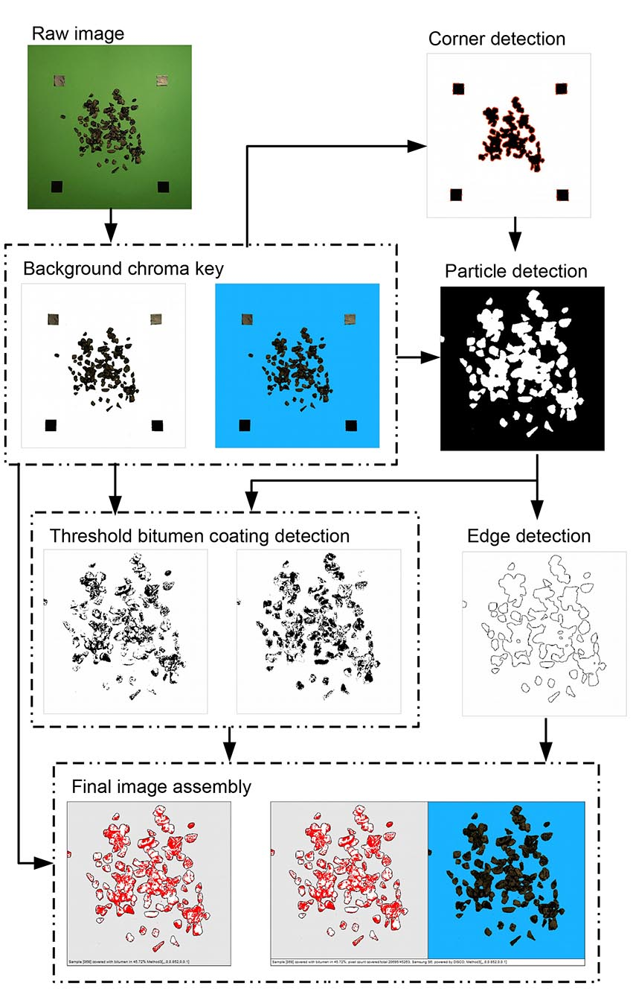
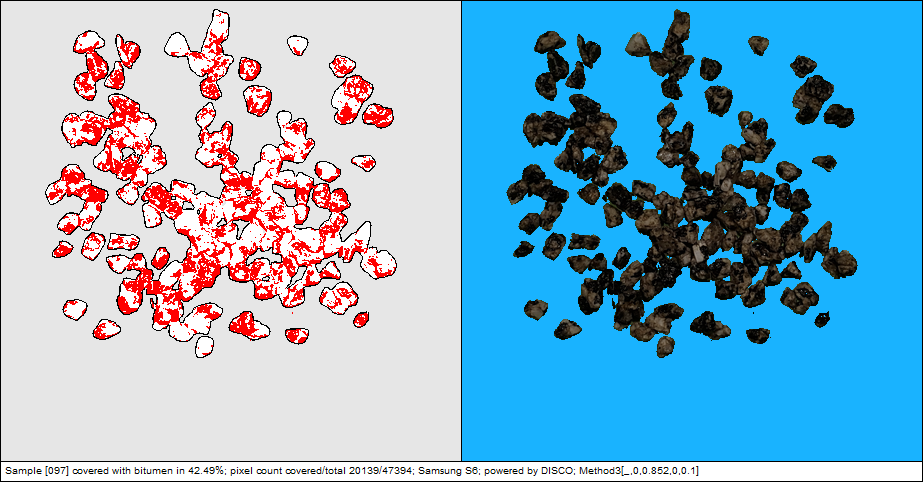

# Readme
The script was written in [Wolfram Mathematica 10](https://www.wolfram.com/mathematica/). The whole DISCO script may be downloaded from this github repo.
## Research paper
[Assessment of Polyethylen-Modified Bitumen Adhesion Using Computer Image Analysis](https://www.researchgate.net/publication/313321283_Assessment_of_Polyethylen-Modified_Bitumen_Adhesion_Using_Computer_Image_Analysis)
### Pipeline

  

## Initialisation
First run the <code>init.nb</code>. Modify the <code>absolutePath</code> variable so that it points to the location of the cloned repo. Then select <code>Evaluation >> Evaluate notebook</code>.
## Single file processing
In order to use the <code>single-file.nb</code> you need to first evaluate <code>init.nb</code> which contains all the procedures, <code>sample</code> variable holds which test image to  in string format. The pipelane variables were calibrated for this particular sample set which is in <code>sample/</code> directory. In order to evaluate a single file select <code>Evaluation >> Evaluate notebook</code>.
### Example result

  

## Batch processing
In order to use the <code>batch.nb</code> you need to first evaluate <code>init.nb</code>. Set the <code>start</code> and <code>stop</code> parameters pointing to the range of files designated for processing. In order to start the batch process select <code>Evaluation >> Evaluate notebook</code>.
## Debugging/calibration
In order to use the <code>debug.nb</code> you need to first evaluate <code>init.nb</code>. The debug modul allows for calibration of the CV parameters namely, edge detection, background chroma etc. Before adjusting the sliders run the notebook by selecting <code>Evaluation >> Evaluate notebook</code>.